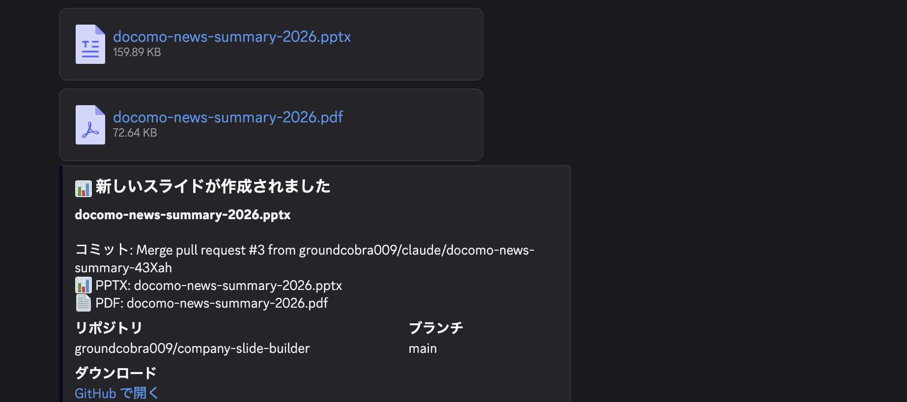
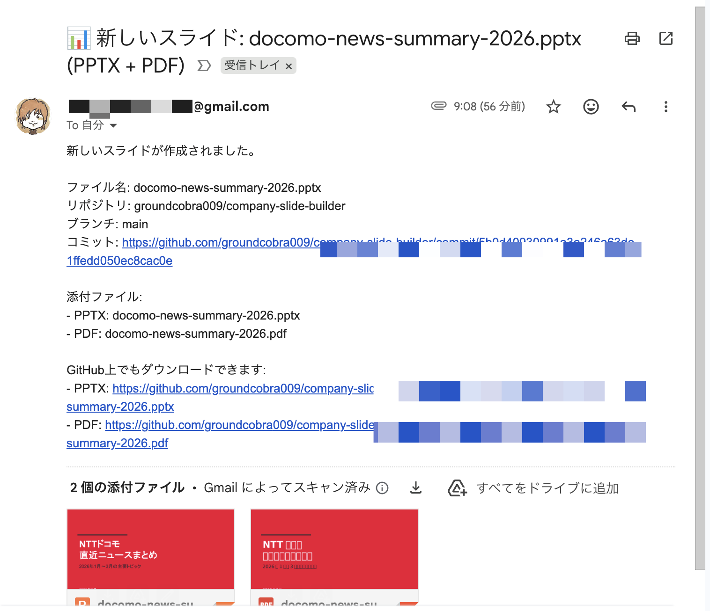
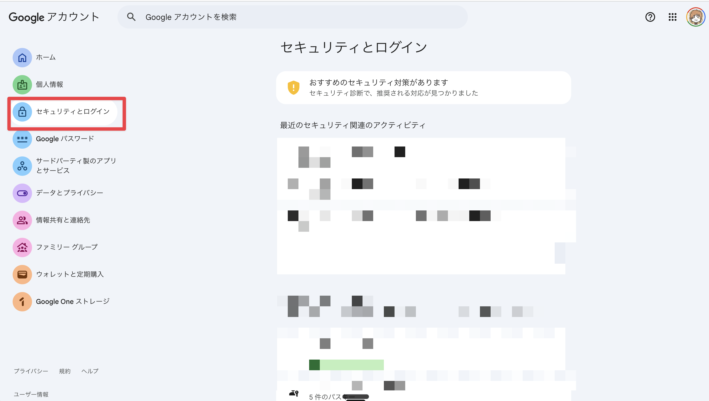
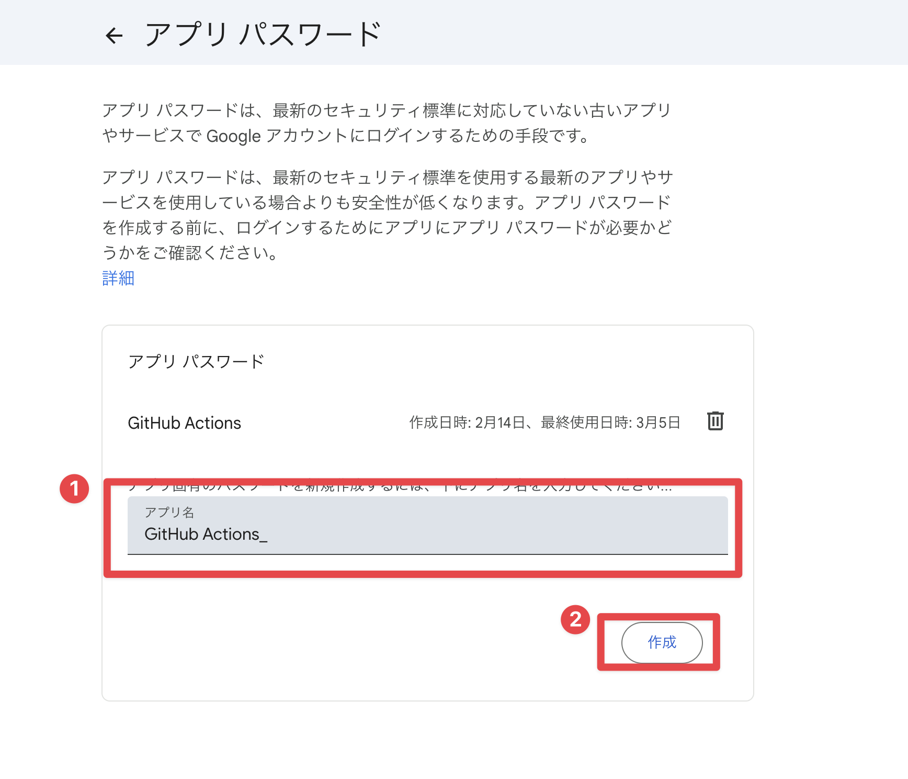
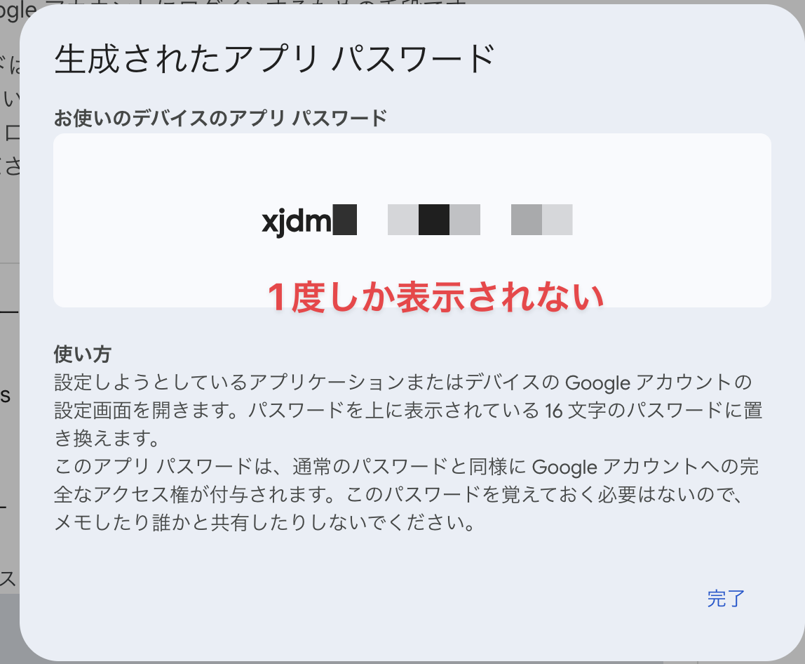
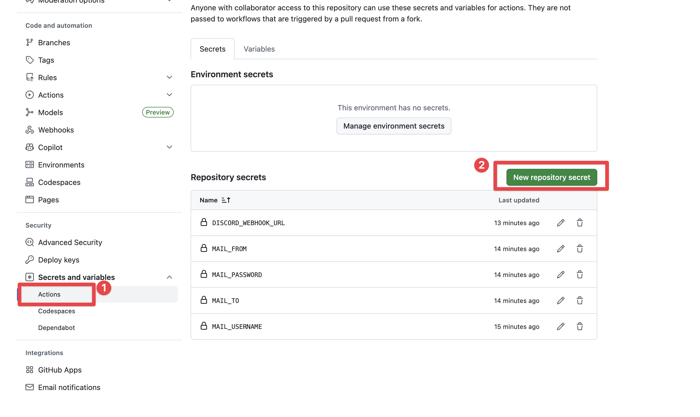
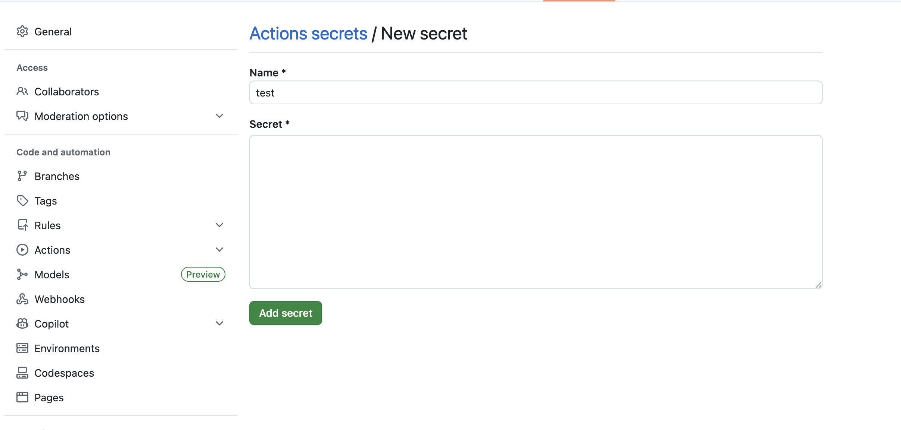

# Company Slide Builder

Claude Codeに指示するだけで、全22パターンの高品質ビジネススライドを自動生成するClaude Codeスキルです。
トヨマネ式メソッド + Cynthialyデザインシステム + ルバート図解パターンを組み合わせた設計思想。

> **Note**: このリポジトリは現在プライベートです。将来的にパブリック公開を予定しています。

## クイックスタート

### 前提条件

- [Node.js](https://nodejs.org/) v16以上
- [Claude Code](https://docs.anthropic.com/en/docs/claude-code) がインストール済み

### 1. リポジトリをクローン

```bash
git clone https://github.com/groundcobra009/company-slide-builder.git
cd company-slide-builder
```

### 2. 依存関係をインストール

```bash
npm install
```

### 3. 出力ディレクトリを作成

```bash
mkdir -p output
```

### 4. Claude Codeで使う

```bash
claude
```

Claude Codeが起動したら、自然言語で指示するだけでスライドが作成されます:

```
「AI市場の最新動向について10枚のプレゼン資料を作って」
「株式会社〇〇のブランドカラーでテンプレートを設定して」
```

### 5. 通知機能を使う場合（任意）

スライド生成後にDiscordやメールで自動通知を受け取りたい場合は、環境変数を設定してください。

```bash
cp .env.example .env
# .env を編集して自分のメールアドレス等を設定
```

GitHub Secretsの設定方法は [環境変数（GitHub Secrets）](#環境変数github-secrets) を参照してください。

設定が完了すると、スライド作成後に以下のような通知が届きます:

**Discord通知**



**メール通知**



## 使い方

### Claude Code経由（推奨）

Claude Codeを起動してスライド作成を指示するだけです。内部で以下のスキルが自動的に連携します:

- **slide-builder**: トピックリサーチ → トヨマネ式設計 → スクリプト生成 → PPTX出力 → 配信
- **design-template**: 企業ブランドカラーのリサーチ・適用、またはモノトーンデフォルト設定

### スクリプトを直接書く場合

`scripts/template.js` をrequireしてNode.jsスクリプトを作成・実行できます。

```javascript
var path = require("path");
var t = require("./scripts/template.js");
var pptxgen = t.pptxgen;

var pres = new pptxgen();
pres.layout = t.config.layout;

t.addTitleSlide(pres, "タイトル", "サブタイトル", "作成者");
// ... スライドを追加 ...

pres.writeFile({ fileName: path.resolve(__dirname, "output/presentation.pptx") });
```

## スキル構成

Claude Codeから使えるスキルが2つあります。

### 1. slide-builder（スライド作成）

リサーチ → 設計 → 生成 → 配信までを一括実行します。

```
ユーザーリクエスト → slide-builder-planner
  ├── content-researcher（トピックリサーチ）
  ├── slide-architect（トヨマネ式7ステップ設計）
  └── slide-scripter（スクリプト生成・実行・配信）
```

### 2. design-template（テンプレートカスタマイズ）

企業ブランドカラーをリサーチして適用、またはモノトーンデフォルトを設定します。

```
ユーザーリクエスト → design-template-planner
  ├── brand-researcher（企業ブランドリサーチ）
  └── template-generator（テンプレート生成・適用）
```

## 利用可能な22パターン

| # | パターン | 用途 |
|---|---------|------|
| 1 | 表紙 | プレゼンの冒頭 |
| 2 | サマリー | 結論と理由の提示 |
| 3 | セクション扉 | 章の区切り |
| 4 | 本文 | テキスト中心の説明 |
| 5 | 列挙型 | 番号付きリスト |
| 6 | 2カラム比較 | 左右2列の比較 |
| 7 | 統計数値 | KPI・数値の強調 |
| 8 | まとめ | 結論とNext Steps |
| 9 | 画像 | 画像の表示 |
| 10 | グラフ | 棒・円・折れ線グラフ |
| 11 | フロー（横型） | 横方向のプロセスフロー |
| 11b | フロー（縦型） | 縦方向のプロセスフロー |
| 12 | 比較対照 | 2要素の詳細比較 |
| 13 | 4象限マトリックス | 2軸4領域の分類 |
| 14 | サイクル図 | 循環プロセス |
| 15 | ガントチャート | スケジュール・工程表 |
| 16 | テーブル | データ一覧・比較表 |
| 17 | 背景型 | カテゴリ＋項目リスト |
| 18 | 拡散型 | 1→多の分岐構造 |
| 19 | 上昇型 | 段階的な成長・ステップ |
| 20 | フロー表型 | フロー矢印＋マトリックス表 |
| 21 | フローマトリックス型 | フロー矢印＋行列マトリックス |
| 22 | マトリックス型 | 行ラベル×列ラベルの表 |

## 環境変数（GitHub Secrets）

スライドを `downloads/` にプッシュすると、GitHub Actionsで自動通知が実行されます。
未設定の項目は自動的にスキップされるため、通知が不要であれば設定不要です。

### GitHub Secretsに設定する変数

リポジトリの **Settings > Secrets and variables > Actions** で設定してください。

| 変数名 | 必須 | 説明 | 設定値の例 |
|--------|------|------|-----------|
| `MAIL_USERNAME` | 任意 | Gmailアドレス（SMTP認証用） | `taro.yamada@gmail.com` |
| `MAIL_PASSWORD` | 任意 | Googleアプリパスワード（16文字） | `abcd efgh ijkl mnop` |
| `MAIL_TO` | 任意 | メール送信先アドレス | `team@example.com` |
| `MAIL_FROM` | 任意 | メール送信元アドレス（通常はMAIL_USERNAMEと同じ） | `taro.yamada@gmail.com` |
| `DISCORD_WEBHOOK_URL` | 任意 | DiscordチャンネルのWebhook URL | `https://discord.com/api/webhooks/1234567890/AbCdEfGh...` |

> **メール通知を使う場合**: `MAIL_USERNAME`・`MAIL_PASSWORD`・`MAIL_TO`・`MAIL_FROM` の4つすべてを設定してください。1つでも欠けるとメール通知はスキップされます。

> **Discord通知を使う場合**: `DISCORD_WEBHOOK_URL` のみ設定すればOKです。

### GitHub Secretsの設定手順

1. GitHubでリポジトリページを開く
2. **Settings**（歯車アイコン）をクリック
3. 左メニューの **Secrets and variables** > **Actions** をクリック
4. **New repository secret** ボタンをクリック
5. **Name** にシークレット名（例: `MAIL_USERNAME`）を入力
6. **Secret** に値（例: `taro.yamada@gmail.com`）を入力
7. **Add secret** をクリック
8. 上記の各変数について繰り返す

### MAIL_PASSWORD の取得方法（Googleアプリパスワード）

通常のGmailパスワードではSMTP認証が失敗します。以下の手順で **アプリパスワード** を発行してください。

#### 前提条件

- Googleアカウントで **2段階認証プロセス** が有効になっていること
- 2段階認証が未設定の場合は、先に有効化が必要です

#### Step 1: Googleアカウントのセキュリティページを開く

1. ブラウザで [https://myaccount.google.com/security](https://myaccount.google.com/security) にアクセス
2. Googleアカウントにログインする



#### Step 2: 2段階認証を有効化する（まだの場合）

1. 「Googleにログインする方法」セクションの **2段階認証プロセス** をクリック
2. 画面の指示に従って、電話番号の確認・認証アプリの設定などを完了する
3. 2段階認証が「オン」になっていることを確認する

<!-- スクリーンショット: 2段階認証の設定画面 -->
<!--  -->

#### Step 3: アプリパスワードを発行する

1. [https://myaccount.google.com/apppasswords](https://myaccount.google.com/apppasswords) にアクセス
   - または、セキュリティページ → 2段階認証プロセス → ページ下部の **アプリ パスワード** をクリック
2. 「アプリ名」に任意の名前を入力する（例: `GitHub Actions`、`SlideBuilder通知` など）
3. **作成** ボタンをクリック



4. 16文字のアプリパスワードが表示される（例: `abcd efgh ijkl mnop`）



5. **パスワードをコピーして、すぐにGitHub Secretsに登録する**

> **重要**: このパスワードは **1度しか表示されません**。画面を閉じると再表示できないため、表示されたらすぐに次のStep 4でGitHub Secretsに登録してください。

#### アプリパスワードの管理について

Google の案内では「覚えておく必要はない」とありますが、GitHub Actions で使う場合は **作成直後にGitHub Secretsへ登録する作業が必要** です。GitHub Secrets に保存すればワークフローから参照できますが、値そのものを後から画面で再表示することはできません。

**推奨する運用フロー:**

1. Google でアプリパスワードを新規作成
2. すぐに GitHub Actions の Secret に登録（下記 Step 4）
3. 動作確認
4. ローカルには残さない

> **補足**: パスワードを忘れた場合やSecret を再設定したい場合は、[アプリパスワード管理ページ](https://myaccount.google.com/apppasswords) で古いものを削除し、新しく発行し直してください。メモアプリやテキストファイルへの保存は避け、保管が必要な場合はパスワードマネージャー1か所に限定するのが安全です。

#### Step 4: GitHubに登録する

1. GitHubリポジトリの **Settings > Secrets and variables > Actions** を開く
2. **New repository secret** をクリック



3. 以下を入力して **Add secret** をクリック:
   - **Name**: `MAIL_PASSWORD`
   - **Secret**: Step 3でコピーした16文字のパスワード（スペースは含めても含めなくてもOK）



#### アプリパスワードに関するよくある質問

<details>
<summary><strong>Q: アプリパスワードは何回でも発行できますか？</strong></summary>

はい、何回でも発行できます。用途ごとに別々のアプリパスワードを発行することも可能です（例: 「GitHub Actions用」「別のアプリ用」など）。
</details>

<details>
<summary><strong>Q: 一度表示されたパスワードを後から確認できますか？</strong></summary>

いいえ、アプリパスワードは **発行時に一度だけ** 表示されます。閉じてしまうと再表示はできません。パスワードを忘れた場合は、古いものを削除して新しいアプリパスワードを発行してください。
</details>

<details>
<summary><strong>Q: アプリパスワードを削除・無効化したい場合は？</strong></summary>

[アプリパスワード管理ページ](https://myaccount.google.com/apppasswords) から、発行済みのアプリパスワードを個別に削除（取り消し）できます。削除すると、そのパスワードを使った認証は即座に無効になります。
</details>

<details>
<summary><strong>Q: 2段階認証を無効にするとどうなりますか？</strong></summary>

2段階認証を無効にすると、発行済みのアプリパスワードはすべて自動的に無効化されます。再度2段階認証を有効にした後、新しいアプリパスワードの発行が必要です。
</details>

### Discord Webhook URLの取得方法

1. Discordで通知を送りたいチャンネルの設定（歯車アイコン）を開く
2. **連携サービス** > **ウェブフック** をクリック
3. **新しいウェブフック** をクリック
4. 名前を設定（例: `SlideBuilder通知`）
5. **ウェブフックURLをコピー** をクリック


6. GitHubの **Settings > Secrets and variables > Actions > New repository secret** で:
   - **Name**: `DISCORD_WEBHOOK_URL`
   - **Secret**: コピーしたURL

## デザインルール（カラー・フォント・レイアウト）

### カラーパレット

`design-template` スキルで企業ブランドカラーに変更可能です。指定がなければモノトーンがデフォルトで適用されます。

| 変数名 | デフォルトHEX | 用途 |
|--------|-------------|------|
| `DARK_GREEN` | `#0D2623` | メインカラー。タイトルバー、ヘッダー背景 |
| `CREAM_YELLOW` | `#E8DE9F` | アクセントカラー。番号バッジ、矢印 |
| `LIGHT_GRAY` | `#F3F3F3` | コンテンツ背景、カードベース |
| `TEXT_DARK` | `#0D2623` | 見出し・強調テキスト |
| `TEXT_MEDIUM` | `#434343` | 本文テキスト |
| `TEXT_LIGHT` | `#595959` | 補助テキスト |
| `WHITE` | `#FFFFFF` | 白テキスト（暗背景上） |
| `HIGHLIGHT_YELLOW` | `#FFFF00` | ハイライト |

### フォント

| 項目 | 値 |
|------|-----|
| フォントファミリー | Noto Sans JP |
| 最小フォントサイズ | 16pt（出所表記のみ12pt） |

### レイアウト

| 項目 | 値 |
|------|-----|
| アスペクト比 | 16:9 |
| 左右マージン | 0.6in |
| コンテンツ幅 | 8.8in |

## テスト

```bash
npm test
```

全22パターンのテストスライドが `output/test_all_patterns.pptx` に生成されます。

## ディレクトリ構成

```
company-slide-builder/
├── .claude/
│   ├── skills/              ← Claude Codeスキル（ルーター）
│   │   ├── design-template.md
│   │   └── slide-builder.md
│   ├── agents/              ← エージェント定義
│   │   ├── brand-researcher.md
│   │   ├── content-researcher.md
│   │   ├── design-template-planner.md
│   │   ├── slide-architect.md
│   │   ├── slide-builder-planner.md
│   │   ├── slide-scripter.md
│   │   └── template-generator.md
│   └── workflows/           ← ワークフロー定義
│       ├── design-template_workflow.md
│       └── slide-builder_workflow.md
├── .github/workflows/       ← GitHub Actions（自動通知）
│   └── notify-pptx.yml
├── docs/
│   └── images/              ← README用スクリーンショット
├── scripts/
│   ├── template.js          ← コアテンプレートライブラリ（22パターン）
│   ├── test.js              ← 全パターンテスト
│   └── presets/             ← 企業カラープリセット
│       ├── index.js         ← プリセット管理（検索・適用）
│       └── docomo.js        ← NTTドコモ
├── references/              ← 参照用IR資料（gitignored）
│   └── docomo/              ← 企業ごとにサブディレクトリ
├── downloads/               ← 配信用（GitHub経由ダウンロード）
│   ├── pptx/
│   └── pdf/
├── output/                  ← 生成ファイル出力先（gitignored）
├── .env.example             ← 環境変数テンプレート
├── .gitignore
├── CLAUDE.md                ← Claude Code用ルール
├── README.md
├── package.json
└── package-lock.json
```

## ライセンス

MIT
